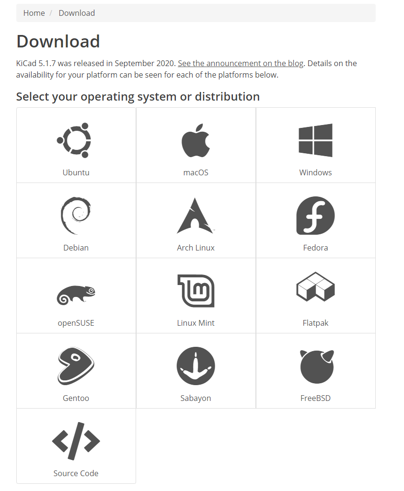
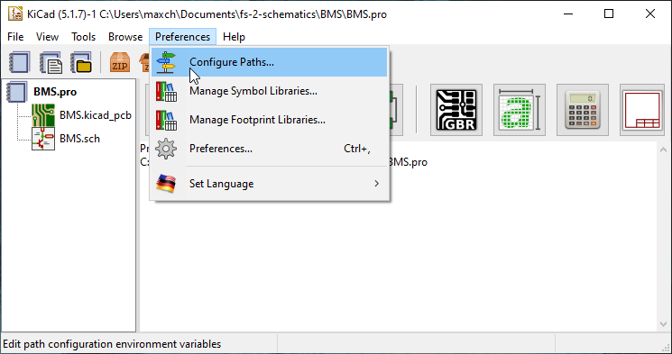
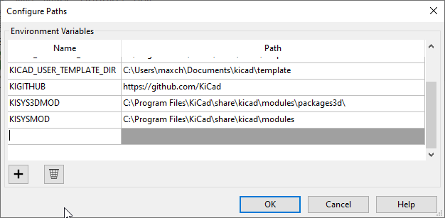
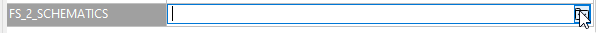
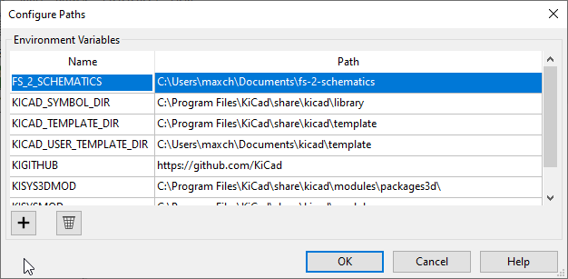
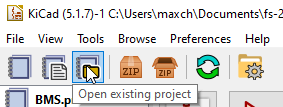

# This is outdated (June 2024)

  
  <h3 align="center">FS-2 Schematics</h3>

  

    This is the electrical schematics repository for the FS-2 racecar.
     
    <a href="https://github.com/formulaslug/fs-2-schematics/issues">Report Bug</a>
    ·
    <a href="https://github.com/formulaslug/fs-2-schematics/issues">Request Feature</a>
  

## Getting started
In depth version of how to get started 🏎️
#### Tools that we are using
* [GitHub](https://github.com)
* [KiCAD](https://kicad-pcb.org/)

1) First, download [KiCAD for your specific OS](https://kicad-pcb.org/download/)

2) Next, make sure you have Git installed.

* [GitHub Desktop](https://desktop.github.com/)
If you are *not* tech savvy
* [Git](https://git-scm.com/downloads)
If you are tech savvy 😎

If you installed GitHub desktop, create an account and close the repository.
I recommend cloning the repository into your documents folder.

[How to clone repositories on GitHub desktop](https://docs.github.com/en/free-pro-team@latest/desktop/contributing-and-collaborating-using-github-desktop/cloning-and-forking-repositories-from-github-desktop)

The repository url is: https://github.com/formulaslug/fs-2-schematics

If you are <b>tech savvy</b> and using Git

`$ git clone https://github.com/formulaslug/fs-2-schematics`

3) Setting the project file path correctly on KiCAD

Make sure KiCAD is currently open

Then click on `preferences -> Configure Paths..`

Click on the plus on the bottom right to add a new path variable

On the left, you want it `FS_2_SCHEMATICS` <- all caps

On the right, you want to set the path where you installed the repository (the folder is called `fs-2-schematics`)

Click on the folder on the right, and find `fs-2-schematics` repo like stated above

Should look something like this after its done

Example (might look different if you are using an Mac, or Linux):

Left side | Right side
------------ | -------------
FS_2_SCHEMATICS | Docs\fs-2-schematics

4) Lastly, open up the project

## Contributing guide

## Projects

### BMS

This is the design for the LTC6811-based BMS module, based on the design from fs-1.
